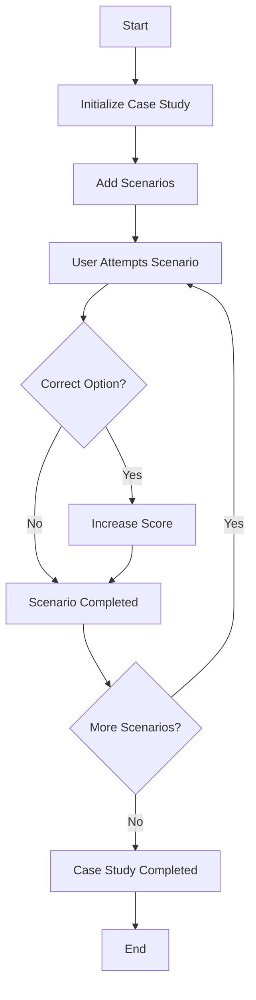

# Smart Case Study 

This repository contains a Solidity smart contract designed to manage interactive case studies on the blockchain. The contract allows the creation of scenarios where users can make decisions and progress through a series of challenges.

## **Vision**

Our vision is to revolutionize how educational and professional case studies are conducted by leveraging blockchain technology. This system offers transparency, fairness, and a decentralized approach to learning and assessment.

## **Flowchart**

## **Smart Contract Overview**

### **Contract Address**
- **EduChain Network:** `0x0514F23892373Ea15ba3589Ab3fE4E5410E98987`

### **Functions**
- **addScenario**: Adds a new scenario to the case study.
- **attemptScenario**: Allows users to attempt the current scenario.
- **getCurrentScenario**: Retrieves the current scenario for the user.
- **getScore**: Returns the user’s score.
- **getTotalScenarios**: Returns the total number of scenarios in the case study.

### **Features**
- **Scenario Management**: Add, manage, and track progress through multiple scenarios.
- **User Interaction**: Users engage with the case study, making decisions that impact their outcomes.
- **Event Emission**: Emits events when scenarios are completed, enabling easy tracking.

## **Future Scope**

1. **Token Rewards**: Implement token rewards for successful completion of case studies.
2. **NFT Integration**: Issue NFTs as badges or certificates upon case study completion.
3. **Multi-Chain Deployment**: Expand deployment to additional blockchain networks for broader access.
4. **Enhanced Analytics**: Add detailed analytics to track user performance and scenario difficulty.

## **Getting Started**

1. **Clone the Repository**: `git clone https://github.com/RajSingh-123/SmartCaseStudy.git`
2. **Install Dependencies**: `npm install`
3. **Deploy to EduChain**: `npx hardhat run scripts/deploy.js --network educhain`

## **Contact**

For any inquiries or contributions, feel free to reach out:

- **Email**:rajsingh3706@gmail.com
- **GitHub**: https://github.com/RajSingh-123

---

This `README.md` provides a clear and concise overview of the project, including the vision, contract functionality, and future developments. 
